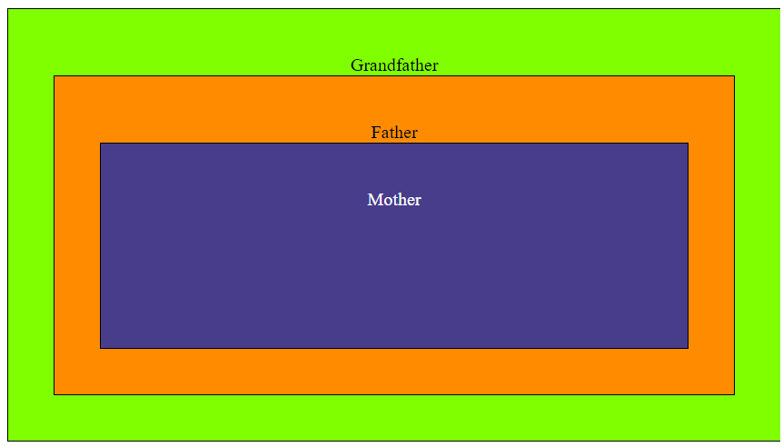

# Lecture-14

## DOM Manipulation

- DOM stands for **Document Object Model**
- BOM stands for **Browser Object Model.** It is web Api.

### For performing DOM Manipulation we need to perform the following steps:-

> **************************************************MODIFY DOM AS MIN AS POSSIBLE**************************************************
> 
1. **********Pick an element to perform some operation**********
    - For picking up element we have 3 ways
        1. Using TagName
        
        ```
        let lists = document.getElementsByTagName('li');
        console.log(lists);
        ```
        
        ii. Using ID
        
        ```
        const para1 = document.getElementById('para-1');
        console.log(para1);
        ```
        
        iii. Using class
        
        ```
        const allPara = document.getElementsByClassName('para');
        console.log(allPara);
        ```
        
        iv. Another way is using ****************************querySelector****************************
        
        ```
        const paras = document.querySelectorAll('p');
        console.log(paras);
        
        const item1 = document.querySelector('.item1');
        console.log(item1);
        
        const item2 = document.querySelector('.item2');
        console.log(item2);
        ```
        
2. ********Performing Operation on selected element********
    - ****************************************************Reading Values of elements****************************************************
        
        ```jsx
        console.log(item2.innerHTML);
        console.log(item2.innerHTML);
        ```
        
    - ******************************************************************We Can also change the values/inner text of the elements******************************************************************
        
        ```jsx
        item2.innerHTML = '<b>Ironman</b>';
        ```
        
    - ************************************************************Note the following way of appending/changing dom is not good, hence it not followed************************************************************
        
        `movieList.innerHTML += '<li class-"item4 listitem">HULK</li>';`
        
    - ************************************Instead this method is used or preferred************************************
        
        ```jsx
        // 1. Ek naya element banao
        let li = document.createElement('li');
        
        // 2. Element ke andar ki value update karlo
        li.innerText = 'Spiderman';
        
        // 3. Jakar is  element ko parent ke andar append kardo
        movieList.appendChild(li);
        
        movieList.removeChild(item2);
        ```
        

## Changing Styles using JS

```jsx
const body = document.querySelector('body');

console.log(body);

const ul = document.querySelector('ul');
```

```jsx
console.log(ul.classList);
// ClassList mei class: add, delete
ul.classList.add("meriList");
```

```jsx
setInterval(() => {
    ul.classList.toggle('meriList');
    body.classList.toggle('meriBody');
}, 100);
```

```jsx
console.log(ul.parentElement);
console.log(ul.previousElementSibling);
console.log(ul.nextElementSibling);
ul.nextElementSibling.remove();
```

## EventListeners

Events are thing that happen in a system you are programming. Events are fired inside the browser window.

Following are the mouse event listeners

```jsx
btn.addEventListener('dblclick', () => {
    console.log("I am double click event!");
});
```

This how event listeners are added on the element.

This is the best way to add event listeners as if we want to add multiple event listeners.

```jsx
btn.onClick = () => {
		console.log("Rajas ne 1 Kalol ka sapna dekhna");
}

// this will override the second event Listener
btn.onClick = () => {
    console.log("I am second eventListener");
}
```

For the above reason this method is not preferred.

Similarly keyborard event listeners are also applied.

Refer :- 

[KeyboardEvent - Web APIs | MDN](https://developer.mozilla.org/en-US/docs/Web/API/KeyboardEvent)

## Forms

Event listeners on forms

1st we have select the forms elements on which we need to work.

```jsx
form.addEventListener('submit', (ev) => { 
    ev.preventDefault();
    console.log(inp.value);
    console.log(no.value);
    inp.value = "";
    no.value = "";
});
```

ev.preventDefault() is used to prevent browaer from reloading after submit button is pressed.

## Event Cycle



If we nested three elements and added event listeners to them individually.

```jsx
grandFather.addEventListener('click', (ev) => {
    console.log("Ruk tere papa ko bataunga");
});

father.addEventListener('click', (ev) => {
    console.log("Belt se service ghar baithe baithe");
    ev.stopPropagation();
});

mother.addEventListener('click', () => {
    console.log("Roti bana rahi thi, ussi chimte se pakad liya");
});
```

The above code will run from inner to outer order.

i.e means pahle nesting ke andar jaega jaha click kiya hai and then bahar aate hue print karega.

so the output will be.

`Roti bana rahi thi, ussi chimte se pakad liya
Belt se service ghar baithe baithe
Ruk tere papa ko bataunga`

```jsx
grandFather.addEventListener('click', (ev) => {
    console.log("Ruk tere papa ko bataunga");
}, true);

father.addEventListener('click', (ev) => {
    console.log("Belt se service ghar baithe baithe");
    // ev.stopPropagation();
}, true);

mother.addEventListener('click', () => {
    console.log("Roti bana rahi thi, ussi chimte se pakad liya");
}, true);
```

The above code will run in normal way i.e while going inwards in nesting.

3rd parameter me true dene se events ka execution nesting me andar jaate samay hoga.

- ye 3rd parameter dena optional hai and iska mix bhi use kiya jaa sakta hai jaise bhi hum code ko run karna chahe.

`Ruk tere papa ko bataunga
Belt se service ghar baithe baithe
Roti bana rahi thi, ussi chimte se pakad liya`

**ev.stopPropogation()** is used to stop the excution of code in either direction the particular element is encountered.