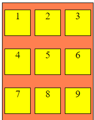

# Lecture-15

## Event Delegation

[Event bubbling](https://developer.mozilla.org/en-US/docs/Learn/JavaScript/Building_blocks/Events#setting_a_listener_on_a_parent_element:~:text=Event%20bubbling).-,Event%20bubbling,-Event%20bubbling%20describes) has its cons but it can be very useful at some situation.

Suppose we have a large numbers of children in an element and we want to apply event listeners to it then event delegation can be very useful and we need not to apply event listeners to every child in it.

```html
<div class="container">
        <div class="item-1 item">1</div>
        <div class="item-2 item">2</div>
        <div class="item-3 item">3</div>
        <div class="item-4 item">4</div>
        <div class="item-5 item">5</div>
        <div class="item-6 item">6</div>
        <div class="item-7 item">7</div>
        <div class="item-8 item">8</div>
        <div class="item-9 item">9</div>
    </div>
```

**************OUTPUT:**************



For example, we have 9 items in a parent container. Now if we need that we get the clicked child. 

A less effective way is to add event listeners to all childs, like in the following way.

```jsx
const item1 = document.querySelector('.item1');
item1.addEventListeners('click', (ev)=>{
		console.log("Clicked", ev.target.innerText);
});

const item2 = document.querySelector('.item1');
item2.addEventListeners('click', (ev)=>{
		console.log("Clicked", ev.target.innerText);
});
... so on all elements.
```

An alternate Way of the above code

```jsx
const items = document.querySelectorAll('.item');

console.log(items);

items.forEach((item) => {
    item.addEventListener('click', (ev) => {
        console.log("Clicked", ev.target.innerText);
    })
})
```

But with Event Delegation this can be avoided and the code will look like this,

```jsx
const container = document.querySelector('.container');
container.addEventListener(() => {
    console.log(ev.target);
});
```

> ************NOTE:************ Now after applying event listeners on parent, if we try to add an element then event listener will automatically applied to new child. because now event listener is on parent not on individual children. This will also help us save our time and memory.
> 

```jsx
// Ab agar iske baad container ke andar element add kia toh uske upar bhi event listener apply ho jaega
// kyuki ab event is on parent and not all the individual children

let div = document.createElement('div');
div.classList.add('item', 'item-10');
div.innerText = 10;
container.appendChild(div); // appenChild works on element whereas append works on text
```

## FETCH METHOD

- It uses a request and a reponse objects.

- fetch() method takes a mandatory arguement i.e. address to the resource you want to fetch.

- fetch() always returns a [PROMISE](https://developer.mozilla.org/en-US/docs/Web/JavaScript/Reference/Global_Objects/Promise).

```jsx
let URL = 'http://cat-fact.herokuapp.com/facts';
const factList = document.querySelector('.factList');
const btn = document.querySelector('btn');

btn.addEventListener('click', () => {
    fetch(URL)
        .then((res) => {
            return res.json();
        })
        .then((data) => {
            console.log(data);
            data.forEach(d => {
                console.log(d);
                let li = document.createElement('li');
                li.innerText = d.text;
                factList.appendChild(li);
            });
        })
        .catch((err) => {
            console.log(err.message);
        })
});
```

The first .then() is mandatory to have the response that is returned from the URL in the [JSON](JSON.md) format ad then `res.json()` will convert json(string) to JS object.

The second .then() receives the data parsed from the json.

Then we have is catch that will handle any error returned from the api.

### Better way to write the above code

```jsx
let URL = 'http://cat-fact.herokuapp.com/facts';
const factList = document.querySelector('.factList');
const btn = document.querySelector('btn');
```

Requiring all the elements

```jsx
function getData(URL) {
    return new Promise((resolve, reject) => {
        fetch(URL)
            .then((res) => {
                return res.json();
            })
            .then((data) => {
                resolve(data);
            })
            .catch((err) => {
                reject(err);
            })
    })
}
```

```jsx
function addDataToList(data) {
    data.forEach(d => {
        let li = document.querySelector('li');
        li.innerText = d.text;
        factList.appendChild(li);
    });
}
```

```jsx
function solve() {
    getData(URL)
        .then((data) => {
            addDataToList(data);
        })
        .catch((err) => {
            console.log(err);
        })
}

btn.addEventListener(() => {
    solve();
});
```

## Async-Await Method

Whenever there is a function which takes time in fetching the information from somewhere else and data does not come whole at a time then we use `await` keyword.

What it means is that await will allow us to fetch the data asynchronously and then store it in a variable.

```jsx
async function getData(URL) {
    try {
        const res = await fetch(URL);
        const receivedData = await res.json();

        // create array of data that we need to add to list
        const data = receivedData.map((d) => d.text );

        addDataToList(data);
    }
    catch (err) {
        console.log(err);
    }
}
```

```jsx
function solve() {
    getData(URL)
}

btn.addEventListener('click', () => {
    solve();
});
```

## AJAX - Asynchronous JavaScript and XML

AJAX is not a technology but rather a way of sending XMLHttpRequests.

```jsx
const URL = 'https://cat-fact.herokuapp.com/facts';
const xhr = new XMLHttpRequest();
const btn = document.querySelector('.btn');
const factsList = document.querySelector('.factsList');
```

```jsx
// Request ke success par yeh chlega
xhr.onload = function (data) {
    console.log(data);
    console.log(data.currentTarget.response); // Ye hume khud decide karna padega dekhkar ki kaha data aa raha hai in response
    const res = JSON.parse(data.currentTarget.response);
    const factsData = res.map((d) => d.text); // Whole data me se text nikal naa
    console.log(factsData)

    addDataToList(factsData);
    // const data = res.text;
}
```

```jsx
// Request ke fail hone par yeh chlega
xhr.onerror = function () {
    console.log("Lagg gai");
}
```

```jsx
// Request kaha bhejni hai define karo
xhr.open("GET", URL);
```

```jsx
// Request ko send kab krna hai?
btn.addEventListener('click', () => {
    xhr.send();
})
```

## Making fetch() function from AJAX

fetch() method is using somewhat AJAX internally.

```jsx
const URL = 'https://cat-fact.herokuapp.com/facts';
const xhr = new XMLHttpRequest();
const btn = document.querySelector('.btn');
const factsList = document.querySelector('.factsList');
```

```jsx
function myFetch(URL) {
    return new Promise((resolve, reject) => {
        // Request ke success par yeh chlega
        xhr.onload = function (data) {
            const res = JSON.parse(data.currentTarget.response);
            resolve(res);
            // const data = res.text;
        }

        // Request ke fail hone par yeh chlega
        xhr.onerror = function (err) {
            reject(err);
        }

        // Request kaha bhejni hai define karo
        xhr.open("GET", URL);

        // Request ko send kab krna hai?
        xhr.send();
    })
}
```

```jsx
btn.addEventListener('click', (ev) => {
    myFetch(URL)
        .then((res) => {
            console.log(res);
        }).catch(err => console.log(err));
})
```

## AXIOS - best way for api fetching when used with async-await

The above mentioned combination is mostly used.

```jsx
const URL = 'https://cat-fact.herokuapp.com/facts';
const btn = document.querySelector('btn');
const factList = document.querySelector('.factList');
```

```jsx
axios.get(URL)
    .then((data) => {
        console.log(data.data);
        const billiKaData = data.data.map((d) => d.text);
        addDataToList(billiKaData);
    })
    .catch(err => {
        console.log(err);
})
```

```jsx
async function solve() {
    try {
        const data = await axios.get(URL);
        const billiKaData = data.data.map((d) => d.text);
        addDataToList(billiKaData);
    }
    catch {
        console.log(err);
    }
}
```