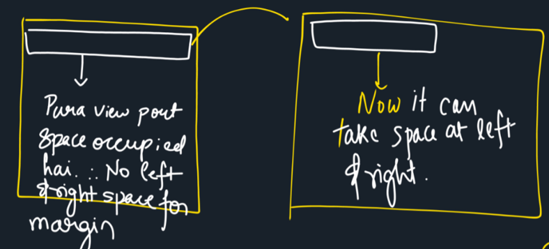

<h2>Lecture - 3</h2>

```
.myclass{
    color: white;
    background-color: royalblue;
    font-weight: 800;
    width: 360px;
    margin: 10px auto;
    border: 2px solid black;
    padding: 5px;
}
```

▶ ```margin: auto;``` will only center the element if it has space on the sides.

▶ This does not work on Top and Bottom because niche tak kitna bhi expand ho sakta hai



<h3 style="text-decoration: underline;">Class</h3>

● One element can have multiple classes, and a class can be applied to multiple elements.

● Class is specified by dot i.e ```.myclass{color: red;}```

● If more than one class is to be applied to a element than it is seperated by space for example 
```<div class="myclass myclass-1">This is my div</div>```

<h3 style="text-decoration: underline;">ID</h3>

● Id is specific to a element.

● It cannnot be duplicate.

● Id is specified in CSS by "#" (Hastag) for example ```#myId{color: blue;} ```

⟫ If the CSS is defined again for a element than last CSS will be applied

<h3 style="text-decoration: underline;">Combinators</h3>

● There are three types of Combinators

1. Direct Child '>'

``` 
// Div ke immediate andar jo bhi p tag hoga uska color change hoga
div > p {
    color: blueviolet;
}
```
2. Immediate Sibling '+'

```
// Isme li saare immediate siblings par color change ho jayega
// 1st vale li par isiliye nahi hua kyuki this means li ke saare bhaiyo ke color change honge that does not mean ki mera bhi color change hoga

li + li {
    color: orangered;
}
```
3. General Sibling '~'

```
// General siblings me li ke saare sibling par apply hoga not imporatant to be immediate

li~li {
    color: blue;
}
```

⨀ Application of these things will be seen when we will actually design web pages.

<h3 style="text-decoration: underline;">Anchor Tag</h3>

⟫ Anchor Tag is used to link 'link' in our web-pages whether it is linking a part of web page for navigating or directing to another page.

● For Linking it to same page navigation. The method is as follows.
```
// This will take us to the para with id para2.
<a href="#para2">Para-2</a>
```

● For Linking to another page of the same website.
```
// This will take to home page then to article with id = "homeArticle"
<a href="home.html#homeArticle">Home-Article</a>
```

● For directing to another website
```
<a href="https://codingblocks.com/">CB</a>
```

<h3 style="text-decoration: underline;">Psuedo Classes</h3>

▶ Psuedo classes are used to add styles to selectors, but only when a certain condition is met 

» Psuedo classes are expressed by colon ":".

» Psuedo classes are divided as <em>LVHA</em>.

```
l -> link
v -> visited
h -> hover
a -> active
```
⟫ These are used as follows :-

→ We can do whatever we want to do these psuedo classes, a small example is given below.
```
a:link {
    text-decoration: none;
    color: palevioletred;
}

a:visited {
    color: palevioletred;
}

a:hover {
    text-decoration: underline;
}

a:active {
    background-color: black;
}
```
» When using these classes the above format as well as order is maintained.